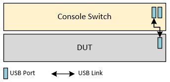

# Console Switch Test Plan

- [Console Switch Test Plan](#console-switch-test-plan)
  * [Background](#background)
  * [Scope](#scope)
  * [Testbed Setup](#testbed-setup)
    + [DUT Wiring](#dut-wiring)
    + [Console Switch Wiring (Loopback mode)](#console-switch-wiring--loopback-mode-)
  * [Test Cases](#test-cases)
    + [1 Driver Test](#1-driver-test)
    + [2 udev Rule Test](#2-udev-rule-test)
    + [3 Reverse SSH](#3-reverse-ssh)
    + [4 Loopback Test](#4-loopback-test)

## Background

This project introduces the concept of Console Switch to provide pluggable console management function in SONiC just like regular Terminal Server. Unlike the typical terminal server, the console switch is a simple box without any management function, it will provide multiple RS232 ports(RJ45) with USB serial converts. Therefore, a SONiC box is required to connect to the console switch with a USB link and all management function will be in the SONiC box.

For more design detail, you can refer to this HLD: [SONiC Console Switch High Level Design](https://github.com/Azure/SONiC/blob/master/doc/console/SONiC-Console-Switch-High-Level-Design.md)

## Scope

The scope of this test plan is to verify correct end-to-end operation of a console switch configuration and usage. This includes control plane testing to verify correct state on the device under test (DUT) and data plane testing to verify correct serial data transfer.

There are no to much hardware level constrains and no SAI dependence either. In a sense, any SONiC box with SSH accessibility can become a terminal server with console switch. So the main focus will be software layer adaptive:

- Console Switch driver
- udev Rules
- Console Switch Configuration
- Reverse SSH

## Testbed Setup

### DUT Wiring

The console switch testbed will reuse current SONiC testbed setup. In addition, a console switch will attached to the DUT via USB link.

Below is the wiring diagram:

There are two USB ports in console switch's panel, the master port will be used to connect the SONiC box.

For different test purpose, the console switch ports need to apply different wiring pattern. Since the virtual serial bridge [RFC 2217](https://tools.ietf.org/html/rfc2217.html) need both server and client installed on two sides, the Console Switch test plan will only introduce the Loopback mode testbed.

### Console Switch Wiring (Loopback mode)

The Console Switch have 48 RS232(RJ45) ports divided into three block in panel.

The wiring pattern is shown below:

- Port 1-16 will attach Loopback Module
- Port 17-18 connect to port 19-20
- Port 21-22 connect to port 27-28
- Port 23-24 connect to port 25-26
- Port 29-30 connect to port 35-36
- Port 31-32 connect to port 33-34
- Port 37-48 will reserved for future virtual serial bridge testing

Loopback Module is a special serial link which connected its own TXD<->RXD, RTS<->CTS, GND<->GND. Below is a sample:

## Test Cases

### 1 Driver Test

| Case | Objective | Test Setup | Expected Control Plane | Expected Data Plane |
|-|-|-|-|-|-|
| Availability | Verify ttyUSB(0-47) are presented in DUT | - | All 48 ttyUSB* devices are presented in DUT | - |

### 2 udev Rule Test

| Case | Objective | Test Setup | Expected Control Plane | Expected Data Plane |
|-|-|-|-|-|-|
| Port Mapping | Verify ttyUSB(0-47) are mapped to C0-(1-48) | - | All 48 C0-* devices are presented in DUT | - |
| Port Shifting Prevent | Verify C0-(33-48) are still remained after unbind some ttyUSB devices | Add temporary udev rule to mask ports 1-8, then unbind/bind the root USB hub(1-1.1) | ttyUSB(0-39) and C0-(9-48) devices are presented in DUT | - |

### 3 Reverse SSH

| Case | Objective | Test Setup | Expected Control Plane | Expected Data Plane |
|-|-|-|-|-|-|
| Connectivity | Verify serial session is available after connect DUT via reverse SSH | Connect DUT serial port via reverse SSH | The session is up and can exit by sending ctrl-A + ctrl-X. The DUT show that port is busy during session and idle after exited. | - |
| Force Interrupt | Verify active serial session can be shut by DUT | Connect DUT serial port `A` via reverse SSH then connect to DUT and clear port `A` | The session ended within 5s and the line state is idle | - |

### 4 Loopback Test

| Case | Objective | Test Setup | Expected Control Plane | Expected Data Plane |
|-|-|-|-|-|-|
| Echo | Verify data can go out through the console switch and come back through the console switch | Send random string to ports 1-16 | - | All sent data echoed back |
| Ping-Pong | Verify data can go out through the console switch and come back through the console switch | Listening a serial port `A` and send "pong" after "ping" came, then send "ping" to opposite port `B` (Port Range: 17-36) | - | Got "pong" back from `B` |
| File Transfer | Verify file can be transferred through the console switch | Ensure there is no `config_db.json` under `\var\tmp` directory. Forward `tcp:localhost:22` to port `A`, send file `\etc\sonic\config_db.json` to opposite port `B` and store it in `\var\tmp\config_db.json` | - | The md5 hash between `\etc\sonic\config_db.json` and `\var\tmp\config_db.json` are same |
